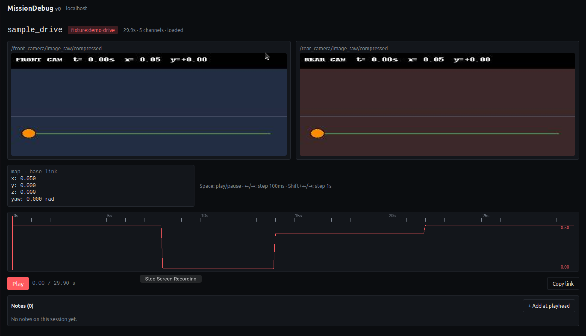

# MissionDebug

> Local-first debugger for ROS 2 robots. Record, detect, replay.

When a robot misbehaves, you want to know what it was seeing 60 seconds before. MissionDebug runs alongside your ROS 2 stack, keeps a rolling 60-second buffer in RAM, and snapshots it to disk when something goes wrong — manually, or automatically when a detector fires (stall, path deviation). Open the web UI, click a session, scrub the timeline.

No cloud. No login. Single robot. Localhost.



## Why this exists

Most ROS debugging tools assume you knew to start recording. MissionDebug always has the last 60 seconds of your robot in RAM and snapshots it when things go wrong — manually, or automatically when a detector fires. The agent runs entirely on the robot; nothing leaves the machine unless you copy it off. Useful in defense, hospital, industrial, and other environments where cloud-first observability isn't an option.

---

## Try it locally

You need Ubuntu 22.04 (or 24.04), ROS 2 Humble (or Jazzy), Python 3.10+, Node 20+, pnpm 9+, and `tmux`.

```bash
git clone https://github.com/mukul-07/missiondebug.git
cd missiondebug
make install

source /opt/ros/humble/setup.bash
MD_FIXTURES=1 make dev
```

Open <http://localhost:5173>. The session list will already contain a `sample_drive` fixture — click it, scrub the timeline.

The fixture is 30 seconds long with a deliberate stall (8–14s) and a 0.8m path deviation (14–22s). Watch the velocity chart drop, the orange dot freeze, then drift off the green line.

---

## Install on a real robot

Build the agent `.deb` (Linux only):

```bash
sudo apt install fakeroot dpkg-dev python3-pip python3-venv
make package
```

Install on the target robot:

```bash
sudo dpkg -i missiondebug-agent_1.0.0_<arch>.deb
sudo nano /etc/missiondebug/config.yaml      # set robot_id + topics
sudo systemctl restart missiondebug-agent
```

The agent runs as a system service, starts at boot, exposes its API on `127.0.0.1:7000`, writes MCAP files to `/var/lib/missiondebug/sessions/`.

`make package` builds **three** debs in `dist/`:

```bash
sudo dpkg -i missiondebug-agent_1.0.0_<arch>.deb     # capture
sudo dpkg -i missiondebug-backend_1.0.0_<arch>.deb   # API + session index, port 8000
sudo dpkg -i missiondebug-web_1.0.0_all.deb         # static UI (backend serves it)
```

Browse to `http://<robot>:8000` for the timeline UI. The backend serves
the web bundle from the same port — no nginx, no separate web service.

```bash
sudo systemctl status missiondebug-agent     # running?
sudo journalctl -u missiondebug-agent -f     # tail logs
sudo nano /etc/missiondebug/config.yaml      # set robot_id + topics
sudo nano /etc/missiondebug/backend.env      # MD_MAX_DISK_MB etc
```

### Configuring the agent

See [examples/README.md](./examples/README.md) for ready-to-edit configs
covering ground vehicles, drones, manipulators, plus a [rule cookbook](./examples/rule-patterns.yaml)
of common detector recipes (battery low, e-stop pressed, planning aborted,
collision-via-force-spike, mode change in flight, etc.).

The rule schema in one block:

```yaml
anomaly:
  rules:
    - name: e-stop-pressed
      topic: /e_stop
      field: data            # dot-path: data, status.status, linear.x, ...
      equals: true           # or: not_equals / lt / gt / lte / gte
      duration_seconds: 0    # how long condition must hold (0 = instant)
      cooldown_seconds: 30   # min gap between fires
```

---

## How it's built

- **Agent** (Python, `agent/`) — rclpy subscribers → 60s ring buffer in RAM → MCAP writer → control HTTP API on `:7000`. Detectors (stall, path-deviation) fire on the same events; both produce labeled sessions.
- **Backend** (FastAPI + SQLite, `backend/`) — auto-rescans the sessions directory every 5s, indexes MCAP metadata, serves files with HTTP range support so the browser can stream the timeline.
- **Web** (React + Vite + PixiJS, `web/`) — Web Worker decodes the MCAP using `@foxglove/rosmsg2-serialization`, renders synchronized video / chart / pose tracks. Annotations stored server-side; URLs are deep-linkable with `?t=23.4`.

Specs:
- [SPEC.md](./SPEC.md) — v0 (record + replay loop, single robot, localhost)
- [v1-SPEC.md](./v1-SPEC.md) — v1 (path-deviation, annotations, share links, `.deb`, fixture)
- [v1.5-SPEC.md](./v1.5-SPEC.md) — v1.5 (config-driven rules, topic dropout, disk retention, full backend/web `.deb`s)

## Tests

```bash
make test                    # 87 tests across agent + backend, ~1s
```

## License

MIT — see [LICENSE](./LICENSE).
