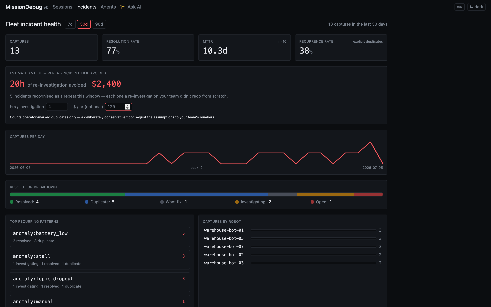
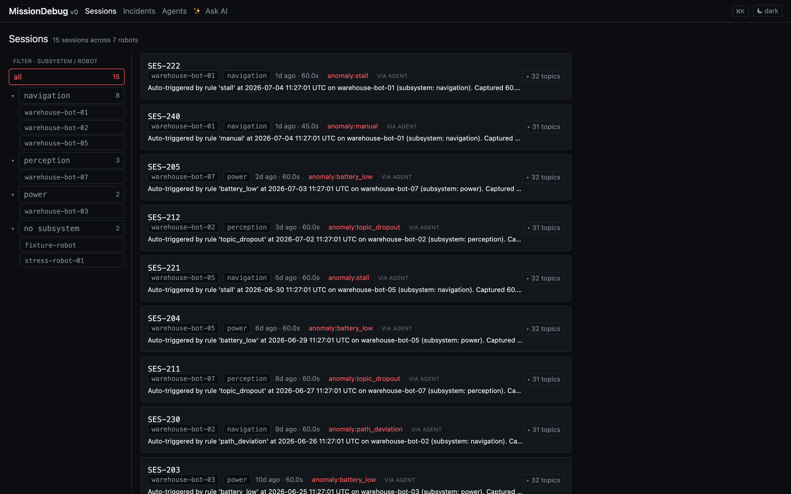
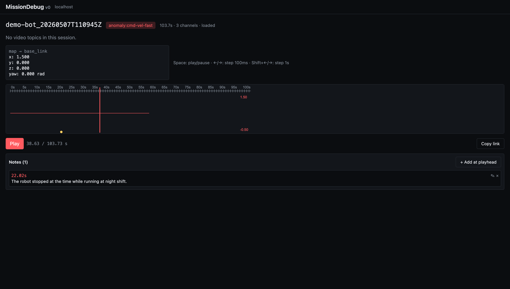

# MissionDebug

[](https://github.com/mukul-07/missiondebug/actions/workflows/test.yml)
[](https://github.com/mukul-07/missiondebug/pkgs/container/missiondebug)
[](https://codecov.io/gh/mukul-07/missiondebug)
[](https://docs.ros.org/)
[](https://www.python.org/)
[](QUALITY_DECLARATION.md)
[-blue.svg)](LICENSING.md)

> **Incident memory for your ROS 2 robot fleet.** Capture the 60 seconds around every failure, replay it like a black box in Foxglove, and query your whole fleet's incident history so your team stops re-solving the same problem.

The deepest fleet-ops pain isn't "I can't find what broke." It's *"we keep re-solving the same incident because nobody remembers it broke this way before."* MissionDebug fixes that. Every capture gets a structured summary; the fleet **incident dashboard** rolls up recurrence rate, MTTR, and top failure patterns; and opening any incident answers **"has this happened before?"**, surfacing similar past incidents *with how they were resolved*.

And you can **ask the whole history in plain English** (*"why does warehouse-bot-03 keep stalling, and what fixed it last time?"*) and get a grounded, citation-backed answer. Bring your own LLM key (Anthropic or OpenAI), or point it at an air-gapped local model.



Under the hood it's a focused capture layer: an agent runs alongside your ROS 2 stack, keeps a rolling buffer of the topics you care about, and writes a standard MCAP the moment a detector fires: stall (commanded-but-not-moving, so a parked robot never false-fires), path deviation, low battery, topic dropout, a cross-topic comparison rule, or any threshold rule you write in YAML. The recording path runs in native code, so it stays light on the robot even with high-rate topics like camera and lidar, which matters on compute-constrained hardware like Jetson. Open the web UI, click a session, scrub the timeline. Annotate the moment, share a deep-linked URL with a teammate.

**Works on any ROS 2 robot:** warehouse AMRs, drones (mavros), manipulators (MoveIt2), agriculture, defense. The agent is topic-agnostic; the warehouse AGV is just the running example. The replay renders camera, pose, velocity, **per-joint** (manipulators), and auto scalar charts from whatever topics you capture. See [`examples/`](./examples/) for ready-to-edit configs per robot type.

Standards-native (MCAP + Foxglove). Local-first: self-hostable end to end, no mandatory cloud, no login, no proprietary format. Air-gap friendly: structured summaries and similarity search work fully offline.

https://github.com/mukul-07/missiondebug/raw/main/docs/demo.mp4

## How MissionDebug fits

| | When to reach for it |
|---|---|
| **MissionDebug** | *After* a failure. "What happened in the 60 seconds before it broke?" Auto-trigger on rules, replay in the browser, annotate, share a timestamped link. |
| [`rosbag2 --snapshot-mode`](https://docs.ros.org/en/rolling/Tutorials/Advanced/Recording-A-Bag-From-Your-Own-Node-CPP.html) | The recording primitive MissionDebug wraps. Same in-memory rolling buffer, but no auto-trigger, no UI, no detection, no retention. Reach for it if you're building your own stack on top. |
| Live-ops tools (e.g. [ros2_medkit](https://github.com/selfpatch/ros2_medkit)) | *During* the incident. "What is the robot doing right now?" Live introspection, fault APIs, remote operations. Different time-shape: complementary, not substitute. |
| Continuous bag recorders | Keep the deep archive of high-volume topics (point clouds, costmaps). MissionDebug owns the focused, replay-ready layer for the topics engineers actually scrub during incidents. |

MissionDebug is the **post-incident layer**. It's what you reach for *after* the alert fires.

**Single robot or whole fleet.** Each agent works standalone: capture + replay on one robot, no hub required. Point agents at a central **hub** (Fleet Edition) and they sync their incident metadata into the fleet dashboard, similarity search, and resolution tracking shown above. The hub is self-hostable end to end and read-only on robots; recordings stay on the robot (or your S3 bucket) by default and never auto-upload.

## Fleet Edition (commercial)

The single-robot **capture + replay + incident dashboard is free and MIT**: run it forever, including commercially. **Fleet Edition** adds the features a 100-robot operation needs, unlocked with a license key:

- **Central hub at fleet scale:** every robot's incidents in one dashboard
- **Ask AI:** query the whole fleet's incident history in plain English (grounded + cited; BYO LLM key or air-gapped local model)
- **Alerting:** Slack / PagerDuty / webhook the moment a robot captures an incident, with the *"Nth occurrence"* recurrence count and a deep-link to the replay
- **OpenTelemetry export:** incidents + KPIs flow into the Grafana / Datadog / alert routing you already run
- **Retention & cold-tier lifecycle:** release old recording bytes on a schedule but keep the incident memory
- **Priority support + onboarding**

Activate by setting a license key on the hub. Without it, the paid features stay off and the free core is unaffected:

```bash
export MD_LICENSE_KEY=<your key>
curl -s http://localhost:8000/api/admin/license   # {"licensed": true, "features": [...], ...}
```

Pricing is **per-robot-per-month** (volume discounts at 100+ robots): see the **[plans & pricing](https://mukul-07.github.io/missiondebug-demos/commercial.html)**. The paid features live in `ee/` (source-visible, proprietary); everything else is MIT, see [LICENSING.md](./LICENSING.md). Try the full product in 60 seconds via the **[demo repo](https://github.com/mukul-07/missiondebug-demos)**.

## Why this exists

Most ROS debugging tools assume you knew to start recording. MissionDebug always has the last 60 seconds of your robot in RAM and snapshots it when things go wrong, manually or automatically when a detector fires. The agent runs entirely on the robot; nothing leaves the machine unless you copy it off. Useful in defense, hospital, industrial, and other environments where cloud-first observability isn't an option.



> Sessions auto-save when a detector fires; the label tells you why. Click one to scrub the timeline.



---

## Try it without installing anything (60 seconds)

No ROS install, no source checkout, just Docker. See [missiondebug-demos](https://github.com/mukul-07/missiondebug-demos): `git clone` then `docker compose up` then land on a populated **fleet incident dashboard** (pre-seeded with a sample incident history), then scrub the `sample_drive` fixture in your browser. It ships a [5-minute demo script](https://github.com/mukul-07/missiondebug-demos/blob/main/docs/DEMO-SCRIPT.md) for walking someone through it.

## Install on a real robot

**One command** — adds the signed apt repository, installs, and wires the config. Idempotent; add `--dry-run` to preview what it would do:

```bash
# Single machine — robot + local dashboard (agent, backend, web UI):
curl -fsSL https://raw.githubusercontent.com/mukul-07/missiondebug/main/scripts/install.sh \
  | sudo bash -s -- --all

# Fleet robot reporting to a central hub (agent only):
curl -fsSL https://raw.githubusercontent.com/mukul-07/missiondebug/main/scripts/install.sh \
  | sudo bash -s -- --hub-url http://<your-hub>:8000

# The hub machine itself (backend + web UI, no agent):
curl -fsSL https://raw.githubusercontent.com/mukul-07/missiondebug/main/scripts/install.sh \
  | sudo bash -s -- --hub
```

Rolling out a whole fleet? [`examples/ansible/`](./examples/ansible/) is a copy-paste playbook: per-robot `robot_id` from the inventory, your hub URL and topics as group vars.

<details>
<summary>Prefer to run the apt commands yourself?</summary>

```bash
sudo install -d /etc/apt/keyrings
curl -fsSL https://mukul-07.github.io/missiondebug/missiondebug-archive-key.asc \
  | sudo gpg --dearmor -o /etc/apt/keyrings/missiondebug.gpg
echo "deb [signed-by=/etc/apt/keyrings/missiondebug.gpg] https://mukul-07.github.io/missiondebug $(lsb_release -cs) main" \
  | sudo tee /etc/apt/sources.list.d/missiondebug.list

sudo apt update
sudo apt install missiondebug-agent missiondebug-backend missiondebug-web
```

Robots that only capture need just `missiondebug-agent`; a central hub machine needs `missiondebug-backend missiondebug-web`. If everything runs on one machine, also add `hub: { url: "http://127.0.0.1:8000" }` to `/etc/missiondebug/config.yaml` so the local dashboard's Agents page and live topic discovery work — the installer's `--all` does this for you.

</details>

Suites: `jammy` (Ubuntu 22.04 / ROS 2 Humble) and `noble` (Ubuntu 24.04 / ROS 2 Jazzy); `amd64` and `arm64` (Jetson, Pi).

**Or grab the `.deb`s directly** from the [latest release](https://github.com/mukul-07/missiondebug/releases/latest) (one-off installs, air-gapped robots):

```bash
# Example: Humble robot on a Jetson (Ubuntu 22.04 arm64)
wget https://github.com/mukul-07/missiondebug/releases/latest/download/missiondebug-agent_VERSION_ubuntu22.04_arm64.deb
sudo apt install ./missiondebug-agent_*.deb
```

(`apt install ./file.deb` resolves the ROS dependencies for you; plain `dpkg -i` doesn't.)

<details>
<summary>Or build the .debs from source (Linux only)</summary>

```bash
sudo apt install fakeroot dpkg-dev python3-pip python3-venv nodejs
sudo npm install -g pnpm
make package
ls dist/
# missiondebug-agent_1.0.0_<arch>.deb       captures sessions
# missiondebug-backend_1.0.0_<arch>.deb     API + session index + retention
# missiondebug-web_1.0.0_all.deb            static UI (backend serves it)
sudo apt install ./dist/*.deb
```

</details>

That's it. All three start automatically and run at boot:

| Service | Port | Purpose |
|---|---|---|
| `missiondebug-agent` | `:7000` (loopback by default; all interfaces when hub-wired) | Subscribes to ROS topics, writes MCAPs on anomaly |
| `missiondebug-backend` | `0.0.0.0:8000` | Indexes MCAPs, serves UI + API |
| (web: static files served by backend) | n/a | UI at `http://<robot>:8000` |

Browse to `http://<robot>:8000` from any machine on the network. No nginx, no separate web service, no proxy.

Working on MissionDebug itself? [CONTRIBUTING.md](./CONTRIBUTING.md) covers running everything from source (`make install` / `make dev`, fixtures included).

---

## How to use it

### 1. Configure the agent for your robot

Two things every robot needs: a **unique `robot_id`** (two robots sharing one id collide into a single entry on the hub — set it before anything else) and the list of **topics to capture**.

The fastest way is the setup wizard — it scans the live ROS graph, pre-checks the topics worth capturing (and warns about ones that *can't* capture, e.g. message packages that aren't built), asks for the robot id and hub URL, and writes the config itself:

```bash
sudo missiondebug-agent init
# non-interactive (accept all recommendations):
sudo missiondebug-agent init --yes --hub-url http://<your-hub>:8000
```

Or edit by hand:

```bash
sudo nano /etc/missiondebug/config.yaml
sudo systemctl restart missiondebug-agent
```

To verify: open the dashboard's **Agents** page and expand your robot's **▸ topics** — it shows every topic on the robot's graph, whether it's being captured, and flags problems (type not built, no publishers). The same check runs automatically from then on: a **⚠ badge** appears on the robot's row if a configured topic stops being capturable. CLI equivalent: `journalctl -u missiondebug-agent -n 30 --no-pager` should show `Subscribed to <topic> [<type>]` for every topic in your config.

For ready-to-edit starting points see [examples/](./examples/):
- [`ground-vehicle-config.yaml`](./examples/ground-vehicle-config.yaml): AMRs, delivery bots, indoor service robots
- [`drone-config.yaml`](./examples/drone-config.yaml): UAV via mavros
- [`manipulator-config.yaml`](./examples/manipulator-config.yaml): robot arm + MoveIt2
- [`rule-patterns.yaml`](./examples/rule-patterns.yaml): copy-paste cookbook of detector recipes

### 2. Drive your robot, sessions appear automatically

Whenever a built-in detector or one of your rules fires, the agent saves the previous 60 seconds as an MCAP. Browse to `http://<robot>:8000` and your sessions show up at the top of the list, labeled with what triggered them (`anomaly:stall`, `anomaly:my-rule-name`, `anomaly:dropout:/lidar`, etc.).

Click a session and the timeline + chart + pose track render. Drag the scrubber, hit space to play, use ←/→ for 100ms steps, Shift+← / Shift+→ for 1s steps. Add notes at the playhead with the **+ Add at playhead** button. Copy a deep-linked `?t=23.4` URL with **Copy link** to share an exact frame with a teammate.

### 3. Save manually

When the robot does something weird but no rule fired, capture the last 60s yourself:

```bash
curl -X POST http://<robot>:7000/sessions/save -H 'Content-Type: application/json' \
  -d '{"label":"weird-behavior-after-corner"}'
```

Refresh the session list and your snapshot is there with that label.

### 4. Write a custom rule

Edit `/etc/missiondebug/config.yaml`:

```yaml
anomaly:
  rules:
    - name: my-rule
      topic: /my_topic
      field: data              # dot-path; e.g. "data" or "status.status" or "linear.x"
      equals: true             # exactly one: equals / not_equals / lt / gt / lte / gte
      duration_seconds: 0      # how long the condition must hold (0 = instant)
      cooldown_seconds: 30     # min gap between fires
```

Restart with `sudo systemctl restart missiondebug-agent`. To verify it loads:

```bash
journalctl -u missiondebug-agent -n 20 --no-pager | grep "Loaded.*rule"
```

To trigger it manually for testing:

```bash
ros2 topic pub --once /my_topic std_msgs/Bool '{data: true}'
ls -lh /var/lib/missiondebug/sessions/    # new MCAP appears
```

See [`examples/rule-patterns.yaml`](./examples/rule-patterns.yaml) for recipes covering numeric thresholds, string equals, boolean flags, and actionlib aborts.

### 5. Manage disk usage

The backend deletes oldest sessions when total MCAP bytes exceed `MD_MAX_DISK_MB` (default: 2048 MB). To change:

```bash
sudo nano /etc/missiondebug/backend.env       # set MD_MAX_DISK_MB=<n>
sudo systemctl restart missiondebug-backend
```

Inspect or force a sweep:

```bash
curl -s http://localhost:8000/api/admin/disk
# {"used_bytes": ..., "used_mb": ..., "cap_mb": 2048, "cap_enabled": true, "session_count": 14}

curl -s -X POST http://localhost:8000/api/admin/sweep
# {"deleted_ids": [...], "bytes_freed": ..., "bytes_after": ..., "cap_bytes": ...}
```

**Age-based lifecycle (fleet).** Beyond the size cap, two opt-in age
policies (both default off):

```bash
# Release the recording bytes after N days but KEEP the incident record:
# the session still shows in the dashboard / similarity / resolution; the
# replay UI shows a calm "recording tiered" card. Incident memory outlives
# the recording.
export MD_COLD_AFTER_DAYS=30
# Purge the whole session (row + file) after N days.
export MD_DELETE_AFTER_DAYS=90

curl -s -X POST http://localhost:8000/api/admin/lifecycle/sweep
# {"cooled_ids": [...], "deleted_ids": [...], "cold_after_days": 30, "delete_after_days": 90}
```

### 6. Useful daily commands

```bash
# Health
sudo systemctl status missiondebug-agent missiondebug-backend
journalctl -u missiondebug-agent -f       # tail capture logs
journalctl -u missiondebug-backend -f     # tail backend/UI logs

# Inspect captures
ls -lh /var/lib/missiondebug/sessions/
curl -s http://localhost:8000/api/sessions | jq '.sessions[0:3]'

# Capture the last 60s right now (always safe — no motion involved)
curl -X POST http://localhost:7000/sessions/save

# Test the stall detector: command motion while the robot can't move.
# ⚠ Only with the base e-stopped / wheels off the ground — a live base WILL move.
# (Stall = commanded velocity above the threshold while odometry reports no
# motion, so publishing zeros can never trigger it.)
timeout 6 ros2 topic pub -r 10 /cmd_vel geometry_msgs/msg/Twist '{linear: {x: 0.5}}'
```

### 7. Common gotchas

- **Agent + your shell on different ROS graphs:** if `ros2 node list` from your shell can't see `/missiondebug_agent`, you have a DDS isolation issue (different RMW_IMPLEMENTATION between the systemd service and your shell). Switch the service to Cyclone DDS:
  ```bash
  sudo apt install -y ros-humble-rmw-cyclonedds-cpp
  sudo systemctl edit missiondebug-agent
  # Add:
  #   [Service]
  #   Environment=RMW_IMPLEMENTATION=rmw_cyclonedds_cpp
  echo 'export RMW_IMPLEMENTATION=rmw_cyclonedds_cpp' >> ~/.bashrc
  sudo systemctl restart missiondebug-agent
  ```
- **Custom message types (px4_msgs and friends):** a topic whose message package isn't built and sourced on the robot is **skipped** — the agent logs `Skipping topic <name>: cannot resolve message type` and captures everything else. Since agent 0.7.4 built colcon workspaces are auto-sourced, so this usually just works; for unusual install locations set `ros_setup_files` in the config (or `MD_ROS_SETUP_FILES`, colon-separated setup.bash paths). The Agents page flags affected topics with a red **type not built** badge.
- **No sessions appearing:** verify the topics in your config exist (`ros2 topic list`), the rule loaded (`journalctl -u missiondebug-agent | grep Loaded`), and the condition is actually being met. Try the manual save above first — it proves the capture path independent of any rule.
- **ROS 1 + ROS 2 env mixed:** if your shell shows `ROS_MASTER_URI` alongside `ROS_DISTRO=humble`, your `~/.bashrc` is sourcing both. Comment out the noetic line.

---

## API

Both services expose interactive Swagger UI at `/docs` and OpenAPI JSON at `/openapi.json`:

```bash
open http://<robot>:7000/docs        # agent (capture)
open http://<robot>:8000/docs        # backend (sessions, files, annotations, admin)
```

Trigger a session save from your existing monitoring with one POST:

```bash
curl -X POST http://<robot>:7000/sessions/save \
  -H 'Content-Type: application/json' \
  -d '{"label":"alertmanager:critical-latency"}'
```

Full endpoint reference + curl cookbook: [`docs/API.md`](./docs/API.md).

## Integrations

MissionDebug captures session data when its built-in detectors fire, but your existing monitoring stack already detects plenty of things the built-in detectors don't. Point those external alerts at the agent's save endpoint and you get root-cause replay for free:

- **Generic webhook:** `curl -X POST .../sessions/save -d '{"label":"..."}'` from any monitoring tool
- **[Prometheus Alertmanager](./docs/INTEGRATIONS.md#2-prometheus-alertmanager-5-minutes):** webhook receiver + small shim that turns `alerts[]` into a label
- **[ros2_medkit Triggers](./docs/INTEGRATIONS.md#3-ros2_medkit-triggers-10-minutes):** bridge script that subscribes to medkit's SSE event stream and forwards triggers

And **outbound**, push incidents *to* the tools you already run (Fleet Edition):

- **OpenTelemetry export:** incidents + KPIs into your Grafana / Datadog / alert routing, no per-vendor connector
- **Native alerting:** Slack / PagerDuty / generic webhook the instant a robot captures an incident, metadata-only and air-gap-safe
- **Ask AI:** a natural-language agent over your incident corpus (BYO LLM key or local model)

Full recipes + working scripts: [`docs/INTEGRATIONS.md`](./docs/INTEGRATIONS.md).

## How it's built

- **Agent** (Python, `agent/`): rclpy subscribers feed per-topic ring buffers in RAM (rate-limited & sized), an MCAP writer, and a control HTTP API on `:7000`. Built-in detectors (stall, path-deviation, battery_low, topic_dropout, cross-topic compare) plus a config-driven rule engine; all detectors auto-save and label the resulting session.
- **Backend** (FastAPI + SQLite, `backend/`): auto-rescans the sessions directory every 5s, indexes MCAP metadata, serves files with HTTP range support so the browser streams. Disk-retention sweeper runs every 30s. Mounts the web UI's static dist at `/` when present.
- **Web** (React + Vite, `web/`): a Web Worker decodes the MCAP using `@foxglove/rosmsg2-serialization`, renders synchronized video / pose / scalar tracks (one chart per numeric topic, filterable), **per-joint charts for `sensor_msgs/JointState`** (one line per joint, arm motion for manipulators), and a JSON inspector at the playhead. Annotations stored server-side; URLs are deep-linkable with `?t=23.4`.

## Tests

```bash
make test                    # 283 tests across agent + backend (94 agent + 189 backend)
```

## License

MissionDebug is **open-core**:

- **Everything except `ee/` is MIT**, see [LICENSE](./LICENSE). This is the
  free Community tier (capture, replay, incident dashboard, similarity,
  resolutions, OpenTelemetry export, BYO-key AI agent, hub core). Free forever,
  commercial use included.
- **The `ee/` directories are proprietary** (MissionDebug Commercial License):
  the paid Fleet / Enterprise features (alerting, lifecycle, and future
  SSO/RBAC + cross-fleet network). Source-visible for evaluation, but
  production/commercial use needs a paid license.

Full details: [LICENSING.md](./LICENSING.md).
