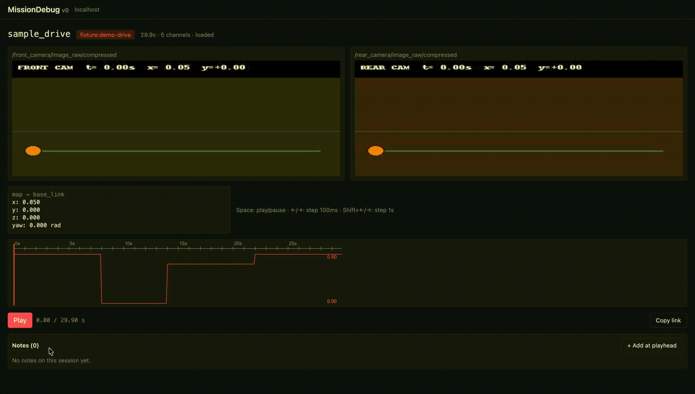

# MissionDebug

[](https://github.com/mukul-07/missiondebug/actions/workflows/test.yml)
[](https://github.com/mukul-07/missiondebug/pkgs/container/missiondebug)
[](https://codecov.io/gh/mukul-07/missiondebug)
[](https://docs.ros.org/)
[](https://www.python.org/)
[](QUALITY_DECLARATION.md)
[](LICENSE)

> **MCAP-native incident replay for ROS 2 robots.** Capture the 60 seconds before a failure, then scrub it like a black box in Foxglove.

When a robot misbehaves, you want the 60 seconds *before* — what it was seeing, what it was commanding, what state it was in. MissionDebug runs alongside your ROS 2 stack, keeps a rolling buffer of the topics you care about, and writes a standard MCAP file the moment something goes wrong. Detectors fire automatically (stall, path deviation, low battery, topic dropout, or any rule you write in YAML). Open the web UI, click a session, scrub the timeline. Annotate the moment, share a deep-linked URL with a teammate.

Standards-native. Local-first. No cloud, no login, no proprietary format.



## How MissionDebug fits

| | When to reach for it |
|---|---|
| **MissionDebug** | *After* a failure. "What happened in the 60 seconds before it broke?" Auto-trigger on rules, replay in the browser, annotate, share a timestamped link. |
| [`rosbag2 --snapshot-mode`](https://docs.ros.org/en/rolling/Tutorials/Advanced/Recording-A-Bag-From-Your-Own-Node-CPP.html) | The recording primitive MissionDebug wraps. Same in-memory rolling buffer, but no auto-trigger, no UI, no detection, no retention. Reach for it if you're building your own stack on top. |
| Live-ops tools (e.g. [ros2_medkit](https://github.com/selfpatch/ros2_medkit)) | *During* the incident. "What is the robot doing right now?" Live introspection, fault APIs, remote operations. Different time-shape — complementary, not substitute. |
| Continuous bag recorders | Keep the deep archive of high-volume topics (point clouds, costmaps). MissionDebug owns the focused, replay-ready layer for the topics engineers actually scrub during incidents. |

MissionDebug is the **post-incident layer**. It's what you reach for *after* the alert fires.

## Why this exists

Most ROS debugging tools assume you knew to start recording. MissionDebug always has the last 60 seconds of your robot in RAM and snapshots it when things go wrong — manually, or automatically when a detector fires. The agent runs entirely on the robot; nothing leaves the machine unless you copy it off. Useful in defense, hospital, industrial, and other environments where cloud-first observability isn't an option.


> Sessions auto-save when a detector fires; the label tells you why. Click one to scrub the timeline.


---

## Try it without installing anything (60 seconds)

No ROS install, no source checkout — just Docker. See [missiondebug-demos](https://github.com/mukul-07/missiondebug-demos): `git clone` → `docker compose up` → scrub the `sample_drive` fixture in your browser.

## Try it locally (5 minutes)

You need Ubuntu 22.04 (or 24.04), ROS 2 Humble (or Jazzy), Python 3.10+, Node 20+, pnpm 9+, and `tmux`.

```bash
git clone https://github.com/mukul-07/missiondebug.git
cd missiondebug
make install

source /opt/ros/humble/setup.bash
MD_FIXTURES=1 make dev
```

Open <http://localhost:5173>. The session list will already contain a `sample_drive` fixture — click it, scrub the timeline.

The fixture is 30 seconds long with a deliberate stall (8–14s) and a 0.8m path deviation (14–22s). Watch the velocity chart drop, the orange dot freeze, then drift off the green line.

---

## Install on a real robot

Build the three `.deb`s (Linux only):

```bash
sudo apt install fakeroot dpkg-dev python3-pip python3-venv nodejs
sudo npm install -g pnpm
make package
ls dist/
# missiondebug-agent_1.0.0_<arch>.deb       — captures sessions
# missiondebug-backend_1.0.0_<arch>.deb     — API + session index + retention
# missiondebug-web_1.0.0_all.deb            — static UI (backend serves it)
```

Install on the target robot:

```bash
sudo dpkg -i dist/missiondebug-agent_1.0.0_<arch>.deb
sudo dpkg -i dist/missiondebug-backend_1.0.0_<arch>.deb
sudo dpkg -i dist/missiondebug-web_1.0.0_all.deb
```

That's it. All three start automatically and run at boot:

| Service | Port | Purpose |
|---|---|---|
| `missiondebug-agent` | `127.0.0.1:7000` | Subscribes to ROS topics, writes MCAPs on anomaly |
| `missiondebug-backend` | `0.0.0.0:8000` | Indexes MCAPs, serves UI + API |
| (web — static files served by backend) | — | UI at `http://<robot>:8000` |

Browse to `http://<robot>:8000` from any machine on the network. No nginx, no separate web service, no proxy.

---

## How to use it

### 1. Configure the agent for your robot

The default config captures `/cmd_vel`, `/tf`, `/plan`, and a camera. To match your stack, edit:

```bash
sudo nano /etc/missiondebug/config.yaml
sudo systemctl restart missiondebug-agent
journalctl -u missiondebug-agent -n 30 --no-pager
```

You should see `Subscribed to <topic> [<type>]` for every topic in your config, plus `Loaded N config-driven rule(s)` if you added rules.

For ready-to-edit starting points see [examples/](./examples/):
- [`ground-vehicle-config.yaml`](./examples/ground-vehicle-config.yaml) — AMRs, delivery bots, indoor service robots
- [`drone-config.yaml`](./examples/drone-config.yaml) — UAV via mavros
- [`manipulator-config.yaml`](./examples/manipulator-config.yaml) — robot arm + MoveIt2
- [`rule-patterns.yaml`](./examples/rule-patterns.yaml) — copy-paste cookbook of detector recipes

### 2. Drive your robot — sessions appear automatically

Whenever a built-in detector or one of your rules fires, the agent saves the previous 60 seconds as an MCAP. Browse to `http://<robot>:8000` and your sessions show up at the top of the list, labeled with what triggered them (`anomaly:stall`, `anomaly:my-rule-name`, `anomaly:dropout:/lidar`, etc.).

Click a session → timeline + chart + pose track render. Drag the scrubber, hit space to play, use ←/→ for 100ms steps, Shift+← / Shift+→ for 1s steps. Add notes at the playhead with the **+ Add at playhead** button. Copy a deep-linked `?t=23.4` URL with **Copy link** to share an exact frame with a teammate.

### 3. Save manually

When the robot does something weird but no rule fired, capture the last 60s yourself:

```bash
curl -X POST http://<robot>:7000/sessions/save -H 'Content-Type: application/json' \
  -d '{"label":"weird-behavior-after-corner"}'
```

Refresh the session list — your snapshot is there with that label.

### 4. Write a custom rule

Edit `/etc/missiondebug/config.yaml`:

```yaml
anomaly:
  rules:
    - name: my-rule
      topic: /my_topic
      field: data              # dot-path; e.g. "data" or "status.status" or "linear.x"
      equals: true             # exactly one: equals / not_equals / lt / gt / lte / gte
      duration_seconds: 0      # how long the condition must hold (0 = instant)
      cooldown_seconds: 30     # min gap between fires
```

Restart with `sudo systemctl restart missiondebug-agent`. To verify it loads:

```bash
journalctl -u missiondebug-agent -n 20 --no-pager | grep "Loaded.*rule"
```

To trigger it manually for testing:

```bash
ros2 topic pub --once /my_topic std_msgs/Bool '{data: true}'
ls -lh /var/lib/missiondebug/sessions/    # new MCAP appears
```

See [`examples/rule-patterns.yaml`](./examples/rule-patterns.yaml) for recipes covering numeric thresholds, string equals, boolean flags, and actionlib aborts.

### 5. Manage disk usage

The backend deletes oldest sessions when total MCAP bytes exceed `MD_MAX_DISK_MB` (default: 2048 MB). To change:

```bash
sudo nano /etc/missiondebug/backend.env       # set MD_MAX_DISK_MB=<n>
sudo systemctl restart missiondebug-backend
```

Inspect or force a sweep:

```bash
curl -s http://localhost:8000/api/admin/disk
# {"used_bytes": ..., "used_mb": ..., "cap_mb": 2048, "cap_enabled": true, "session_count": 14}

curl -s -X POST http://localhost:8000/api/admin/sweep
# {"deleted_ids": [...], "bytes_freed": ..., "bytes_after": ..., "cap_bytes": ...}
```

### 6. Useful daily commands

```bash
# Health
sudo systemctl status missiondebug-agent missiondebug-backend
journalctl -u missiondebug-agent -f       # tail capture logs
journalctl -u missiondebug-backend -f     # tail backend/UI logs

# Inspect captures
ls -lh /var/lib/missiondebug/sessions/
curl -s http://localhost:8000/api/sessions | jq '.sessions[0:3]'

# Trigger a stall manually (publishes zero cmd_vel for 6s)
timeout 6 ros2 topic pub -r 10 /cmd_vel geometry_msgs/Twist '{linear: {x: 0.0}}'
```

### 7. Common gotchas

- **Agent + your shell on different ROS graphs** — if `ros2 node list` from your shell can't see `/missiondebug_agent`, you have a DDS isolation issue (different RMW_IMPLEMENTATION between the systemd service and your shell). Switch the service to Cyclone DDS:
  ```bash
  sudo apt install -y ros-humble-rmw-cyclonedds-cpp
  sudo systemctl edit missiondebug-agent
  # Add:
  #   [Service]
  #   Environment=RMW_IMPLEMENTATION=rmw_cyclonedds_cpp
  echo 'export RMW_IMPLEMENTATION=rmw_cyclonedds_cpp' >> ~/.bashrc
  sudo systemctl restart missiondebug-agent
  ```
- **No sessions appearing** — verify the topics in your config exist (`ros2 topic list`), the rule loaded (`journalctl -u missiondebug-agent | grep Loaded`), and the condition is actually being met. Try the manual stall trigger above first.
- **ROS 1 + ROS 2 env mixed** — if your shell shows `ROS_MASTER_URI` alongside `ROS_DISTRO=humble`, your `~/.bashrc` is sourcing both. Comment out the noetic line.

---

## API

Both services expose interactive Swagger UI at `/docs` and OpenAPI JSON at `/openapi.json`:

```bash
open http://<robot>:7000/docs        # agent (capture)
open http://<robot>:8000/docs        # backend (sessions, files, annotations, admin)
```

Trigger a session save from your existing monitoring with one POST:

```bash
curl -X POST http://<robot>:7000/sessions/save \
  -H 'Content-Type: application/json' \
  -d '{"label":"alertmanager:critical-latency"}'
```

Full endpoint reference + curl cookbook: [`docs/API.md`](./docs/API.md).

## How it's built

- **Agent** (Python, `agent/`) — rclpy subscribers → per-topic ring buffers in RAM (rate-limited & sized) → MCAP writer → control HTTP API on `:7000`. Built-in detectors (stall, path-deviation, battery_low, topic_dropout) plus a config-driven rule engine; all detectors auto-save and label the resulting session.
- **Backend** (FastAPI + SQLite, `backend/`) — auto-rescans the sessions directory every 5s, indexes MCAP metadata, serves files with HTTP range support so the browser streams. Disk-retention sweeper runs every 30s. Mounts the web UI's static dist at `/` when present.
- **Web** (React + Vite + PixiJS, `web/`) — Web Worker decodes the MCAP using `@foxglove/rosmsg2-serialization`, renders synchronized video / chart / pose tracks. Annotations stored server-side; URLs are deep-linkable with `?t=23.4`.

Specs:
- [SPEC.md](./SPEC.md) — v0 (record + replay loop, single robot, localhost)
- [v1-SPEC.md](./v1-SPEC.md) — v1 (path-deviation, annotations, share links, `.deb`, fixture)
- [v1.5-SPEC.md](./v1.5-SPEC.md) — v1.5 (config-driven rules, topic dropout, disk retention, full backend/web `.deb`s)

## Tests

```bash
make test                    # 87 tests across agent + backend, ~1s
```

## License

MIT — see [LICENSE](./LICENSE).
